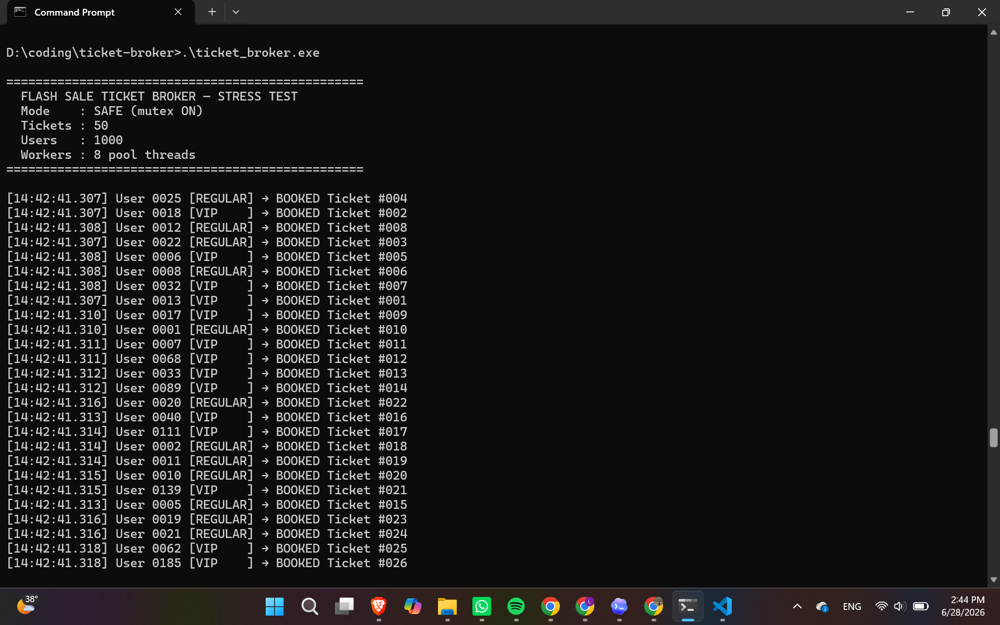
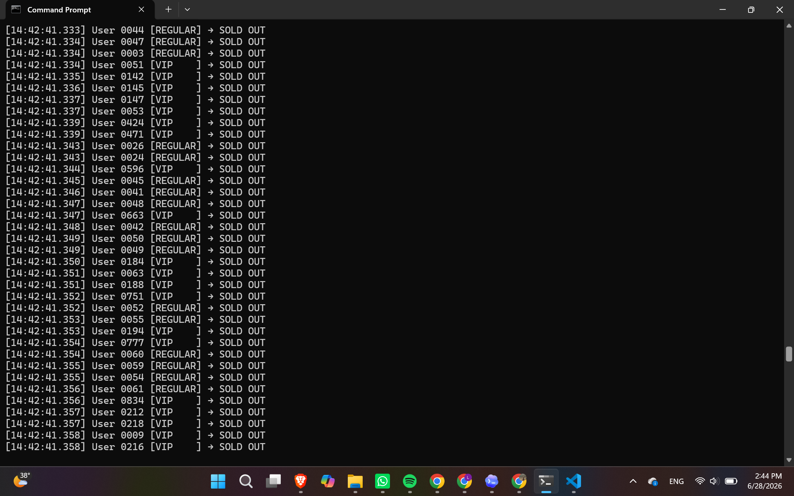
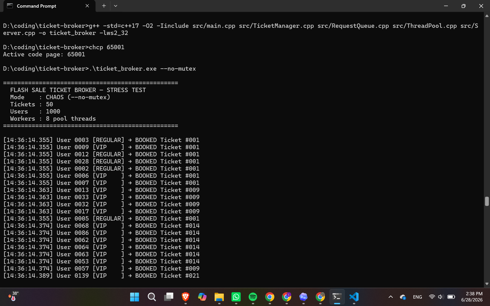
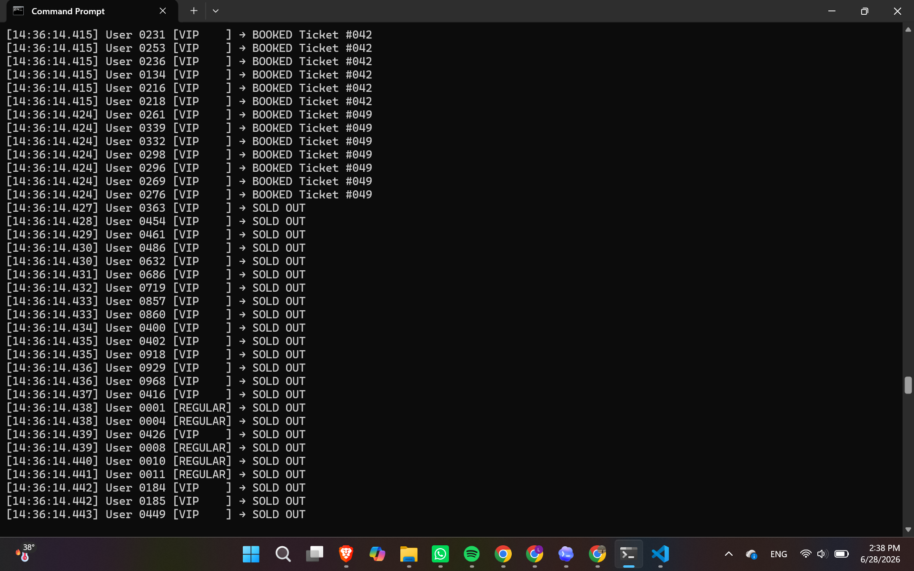
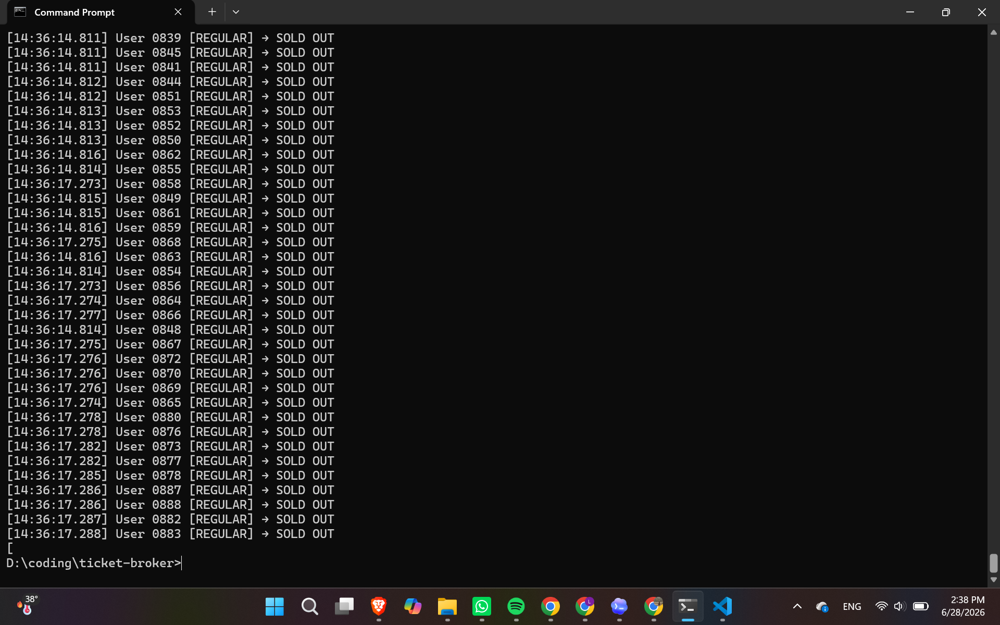

# 🎫 Flash-Sale Concurrent Ticket Broker

A multithreaded C++17 ticket booking engine that simulates an **IRCTC Tatkal-style flash sale**- thousands of clients competing for a limited amount of seats at the exact same millisecond. Built to demonstrate OS-level concurrency: mutex-protected shared state, condition-variable-based thread synchronization, priority scheduling, and raw TCP networking- then wired up end-to-end with a live browser demo.

The core of the project is a side-by-side comparison: same 1000 threads, same 50 seats, **one flag difference**.

| Mode | Result |
|---|---|
| Mutex ON (safe) | 50/50 booked, **zero double-bookings** |
| Mutex OFF (`--no-mutex`) | Duplicate ticket IDs, **memory corruption, program crash** |

---

## 🔴 Live Demo

Click seats, book real tickets, watch the log- every click sends an actual TCP command to a C++ server running in the cloud.

**Try it here:** [deluxe-arithmetic-50f432.netlify.app/seat-map.html](https://deluxe-arithmetic-50f432.netlify.app/seat-map.html)

The demo is three separate services talking to each other over the internet:

| Piece | Role | Hosted on |
|---|---|---|
| `seat-map.html` | The seat grid you click | [Netlify](https://deluxe-arithmetic-50f432.netlify.app/seat-map.html) |
| `bridge.js` | Translates browser HTTP → raw TCP | [Render](https://ticket-broker-bridge.onrender.com) |
| `ticket_broker.exe --server` | The actual C++ engine (mutex, thread pool, priority queue) | Railway, via a TCP proxy |

```
Browser (Netlify)
    │  HTTP POST /book
    ▼
Node.js bridge (Render)
    │  raw TCP "BOOK_TICKET 42 Arjun VIP"
    ▼
C++ engine (Railway, TCP proxy)
    │  mutex-protected booking logic
    ▼
Response flows back up the same chain
```

A quick note: the C++ engine is only reachable through Railway's TCP proxy, not a normal HTTPS URL- browsers can't speak raw TCP directly, which is exactly why the Node bridge exists. The free tiers on Render/Railway may also take 30–50 seconds to wake up if the demo has been idle for a while- that's a cold start, not a bug. This is a presentation demo made to illustrate the basic mutex- no mutex importance.

---

## The Problem

Real-world flash sales (IRCTC Tatkal, concert ticket drops, e-commerce flash deals) run into a brutal concurrency problem: thousands of users hit "Book" within the same millisecond for a tiny pool of seats. If the booking logic isn't properly synchronized, the same seat can get sold to multiple people at once- a race condition with real financial and reputational consequences.

I came accross Mutex and wondered how it can be applied for real life examples, and hence built this project to demo test that by building intentional broken demo codes and then running with on/off mutex.

This project rebuilds that exact scenario from scratch and proves, with a live before/after demo, why thread synchronization isn't optional.
---

## Architecture (engine internals)

```
TCP Client
    │  "BOOK_TICKET 42 Arjun VIP"
    ▼
Server            - accept loop; one lightweight thread per client just to read the command
    │  parses into BookingRequest struct
    ▼
RequestQueue      - thread-safe priority_queue + condition_variable
    │  VIP requests bubble to the top; pop() blocks workers until work is available
    ▼
ThreadPool        - 8 fixed worker threads, each looping forever
    │  calls bookTicket()
    ▼
TicketManager     - the shared resource; mutex-protected decrement + ID assignment
    │  returns ticketId or -1 (SOLD OUT)
    ▼
Response sent back to client (TCP mode) or printed to console (stress-test mode)
```

### Components

- **`BookingRequest`**- data packet for one booking attempt. Implements a custom `operator<` so VIP requests always outrank Regular ones in the priority queue, with earlier-arrival as the tiebreaker.
- **`TicketManager`**- owns the shared `availableTickets` counter. This is the *only* place tickets get decremented, and it's the only critical section protected by a mutex.
- **`RequestQueue`**- a thread-safe wrapper around `std::priority_queue`. Uses `std::condition_variable` so idle worker threads sleep at the OS level instead of busy-polling and wasting CPU.
- **`ThreadPool`**- a fixed pool of 8 worker threads created once at startup, avoiding the overhead of spawning a new OS thread for every single request.
- **`Server`**- the only networking-aware component. Raw TCP sockets via Winsock2, zero business logic- just reads commands and hands them to the queue.
- **`bridge.js`**- the only piece that isn't C++. A small Node.js HTTP server that exists purely because browsers can't open raw TCP sockets. It takes a JSON POST, reformats it as the exact text command the C++ server expects, and relays the response back.

---

## The Race Condition Demo

Run the exact same 1000-thread / 50-seat stress test twice:

**Safe run- mutex protects the critical section:**
```
.\ticket_broker.exe
```



Result: 50 tickets booked, VIPs consistently served first, **zero double-bookings**.

**Chaos run- mutex removed, artificial delay widens the race window:**
```
.\ticket_broker.exe --no-mutex
```




Result: the **same ticket ID gets handed out to multiple users simultaneously**, and the unsynchronized writes eventually corrupt memory and **crash the program outright**. This is the exact failure class mutexes exist to prevent.

---

## Why I built it this way

I could've just written the "correct" multithreaded version and called it done, but the reasoning behind each choice only really clicked once I tried the wrong version as well. A few of these:

**Thread pool instead of spawning a thread per request.** My first instinct was actually to just spawn a thread for every incoming booking- it's simpler to write. But at 1000 simultaneous requests, that's 1000 OS threads getting created almost at once, and thread creation isn't free- it's roughly 50-100µs each, plus the OS now has to context-switch between a thousand of them. A fixed pool of 8 workers pulling from a queue is the same idea Java's `ExecutorService` uses, and it's night-and-day faster under load.

**`condition_variable` instead of a while-loop checking for work.** The naive version of "wait for work" is a loop that keeps asking "is there anything yet? is there anything yet?"- which pins a CPU core at 100% doing nothing useful. `cv.wait()` actually parks the thread at the OS level and only wakes it up when there's real work, so idle workers cost basically zero CPU.

**A priority queue instead of plain FIFO.** IRCTC Tatkal (and basically every real flash-sale system) tiers users- premium bookings get priority. A first-come-first-served queue can't express that at all, so I gave `BookingRequest` a custom comparator: VIP always outranks Regular, and ties break on arrival order.

**TCP over UDP.** This one's not subtle- losing a booking confirmation packet means a user thinks they didn't get a ticket when they actually did (or vice versa). TCP's delivery guarantee isn't optional here.

**Raw Winsock2 sockets instead of a networking library.** Boost.Asio would've been faster to write, but the whole point of this project was understanding what `bind()`/`listen()`/`accept()` are actually doing- a library would've hidden exactly the part I wanted to learn.

**Zero external dependencies.** Every single `#include` in this codebase is something I can walk through line by line for my recalling and ease. Nothing is a black box.

---

## Build & Run (local)

**Requirements:** C++17 compiler (tested with w64devkit / MinGW g++ on Windows 11)

```bash
g++ -std=c++17 -O2 -Iinclude src/main.cpp src/TicketManager.cpp src/RequestQueue.cpp src/ThreadPool.cpp src/Server.cpp -o ticket_broker -lws2_32
```

**Run modes:**
```bash
chcp 65001                       # fixes arrow character rendering in the terminal
.\ticket_broker.exe              # stress test: 1000 users, 50 seats, mutex ON
.\ticket_broker.exe --no-mutex   # same test, mutex OFF - watch it break
.\ticket_broker.exe --server     # TCP server mode, listens on port 8080
```

**TCP protocol** (when running `--server`):
```
BOOK_TICKET <userId> <userName> <VIP|REGULAR>
```

---

## Project Structure

```
ticket-broker/
├── assets/                 ← demo screenshots (safe run vs chaos run)
├── frontend/
│   ├── bridge.js           ← Node.js HTTP→TCP bridge (deployed on Render)
│   ├── seat-map.html       ← seat map UI (deployed on Netlify)
│   └── package.json
├── include/
│   ├── BookingRequest.h
│   ├── RequestQueue.h
│   ├── Server.h
│   ├── ThreadPool.h
│   └── TicketManager.h
├── src/
│   ├── main.cpp
│   ├── RequestQueue.cpp
│   ├── Server.cpp
│   ├── ThreadPool.cpp
│   └── TicketManager.cpp
├── Dockerfile               ← for Railway C++ deployment
└── CMakeLists.txt
```

---

## What I Learned

Building the broken version alongside the working one taught me more than just writing the "right" version would have. It's one thing to know you're supposed to protect shared state with a mutex because every OS course says so- it's a different thing entirely to watch two threads both read `availableTickets > 0`, both pass the check, both decrement it, and both walk away thinking they got a valid ticket. Seeing that produce an actual duplicate ticket ID, and then watching the unsynchronized writes eventually corrupt memory badly enough to crash the whole program, made the concept stick in a way that reading about race conditions never did. Made me also add the millisecond barrier due to ultra fast OS to make me see the differences it can cause, pretty much a lot!

The deployment side taught me something different- mostly that "it compiles and runs on my machine" and "it's actually live for a stranger to use" are two very different bars. Getting a raw TCP C++ server to talk to a browser meant learning that browsers fundamentally can't open TCP sockets, which is why the Node bridge exists at all, and that cloud platforms like Railway default to HTTP-only routing unless you explicitly ask for a TCP proxy. None of that shows up in a systems-programming course or textbook, but it's the kind of gap between "understanding concurrency" and "shipping something people can click on" that this project ended up covering.

---